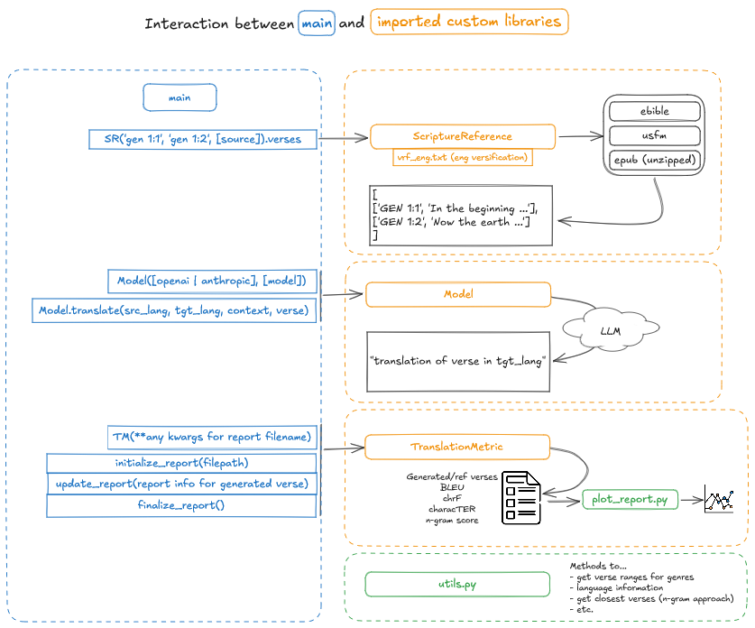

# Scripture Translation Evaluation Tool

This tool automates the process of translating scripture passages and evaluating the quality of translations using various metrics.

## Parameters

The following parameters can be adjusted in `main.py`:

```python
_#*******************************PARAMETERS*************************************_

model_api = "anthropic" _# or "openai" | "anthropic"_
model_name = "claude-3-5-sonnet-20240620" _# "gpt-4o" | "claude-3-5-sonnet-20240620" |_
number_closest_verses = 32 _# Number of verse examples to provide to the model_
max_ngram = 3 _# Maximum n-gram length to consider for context matching_
genre = "historical" _# options: historical, prophetic, poetic, wisdom, gospel, epistle, apocalyptic, law (see utils.py)_
source_lang = "English" _# see utils.py for available languages_
target_lang = "Tamazight" _# see utils.py for available languages_
perform_translation = True _# If False, only calculate and report n-gram scores without translation_

_# Curriculum parameters_
curriculum = False _# If True, use waha_curriculum; if False, use genre_
start_verse = "gen 1:1" _# Starting verse for curriculum_

_#******************************************************************************_
```

## Custom Libraries




### ScriptureReference.py

This module handles parsing and retrieving scripture references.

Usage:

```python

from ScriptureReference import ScriptureReference

scripture_ref = ScriptureReference('lev 5:20', 'lev 5:26', "eng-eng-asv")

verses = scripture_ref.verses
```

### Model.py

This module interfaces with translation APIs (Anthropic or OpenAI).

Usage:

```python
from Model import Model

model = Model(api="anthropic", model_name="claude-3-5-sonnet-20240620")

translated_text = model.translate(source_lang, target_lang, closest_verses, verse)
```

### TranslationMetric.py

This module calculates various translation quality metrics.

Usage:

```python
from TranslationMetric import TranslationMetric

evaluator = TranslationMetric(model_name="MyModel", samples_per_translation=32, source_code="eng", target_code="tmh", genre="historical", max_ngram=3)

evaluator.initialize_report("report.json")

evaluator.update_report(verse, translated_text, gold_standard, reference, ngram_score)

evaluator.finalize_report()
```

## Running the Script

1. Set the desired parameters in `main.py`.
2. Ensure all required environment variables are set (API keys, etc.).
3. Run the script

The script will process the specified verses, perform translations (if enabled), and generate a report with translation quality metrics.